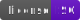

<picture>
  <source media="(prefers-color-scheme: dark)" srcset="https://github.com/kathysledge/smig/raw/main/media/smig-logo-dark.svg">
  
</picture>

### SurrealDB schema management with automatic migrations

<!--
https://img.shields.io/badge/Productivity-Max-db61ff
https://img.shields.io/badge/License-ISC-640ec6
-->

 
[](https://opensource.org/license/isc-license-txt)

---

**smig** is the first library to provide **automatic migration generation** for SurrealDB. Define your schema once using a type-safe API, and let **smig** handle the rest.

📖 **[Full documentation ›](https://smig.build/)**

---

## Installation

```zsh
# Bun (recommended)
bun add -D smig

# npm
npm install -D smig

# pnpm
pnpm add -D smig
```

## Quick start

```zsh
# Initialize project (creates schema.ts)
bun smig init

# Preview migration
bun smig diff

# Apply to database
bun smig migrate
```

## Example schema

```typescript
import {
  defineSchema,
  composeSchema,
  string,
  bool,
  datetime,
  record,
  array,
  index,
} from 'smig';

const userSchema = defineSchema({
  table: 'user',
  fields: {
    email: string().required().assert('string::is_email($value)'),
    name: string().required(),
    isActive: bool().default(true),
    createdAt: datetime().default('time::now()'),
  },
  indexes: {
    email: index(['email']).unique(),
  },
});

const postSchema = defineSchema({
  table: 'post',
  fields: {
    author: record('user').required(),
    title: string().required(),
    content: string().required(),
    embedding: array('float'),  // For AI/vector search
    createdAt: datetime().default('time::now()'),
  },
  indexes: {
    author: index(['author', 'createdAt']),
    // HNSW vector index for semantic search
    semantic: index(['embedding'])
      .hnsw()
      .dimension(1536)
      .dist('COSINE'),
    // Full-text search
    contentSearch: index(['content'])
      .search()
      .analyzer('english')
      .highlights(),
  },
});

export default composeSchema({
  models: { user: userSchema, post: postSchema },
});
```

## Features

| Feature | Description |
|---------|-------------|
| **Automatic migration generation** | No more writing SurrealQL diffs by hand |
| **Bidirectional migrations** | Auto-generated rollback scripts |
| **Type-safe schema definition** | Full TypeScript intellisense |
| **All field types** | String, int, float, datetime, uuid, array, record, geometry |
| **Advanced indexes** | Unique, HNSW vector search, full-text with BM25 |
| **Graph relations** | First-class support for relation tables |
| **Events & triggers** | Business logic automation |
| **Custom functions** | Reusable database functions |
| **Authentication** | Access methods with SIGNUP/SIGNIN |
| **Full-text search** | Custom analyzers with tokenizers and filters |
| **Mermaid diagrams** | Auto-generate ER diagrams |

## CLI commands

| Command | Description |
|---------|-------------|
| `bun smig init` | Initialize a new project |
| `bun smig diff` | Preview migration from schema changes |
| `bun smig migrate` | Apply pending migrations |
| `bun smig status` | Show migration status |
| `bun smig rollback` | Undo the last migration |
| `bun smig mermaid` | Generate ER diagram |

## Documentation

- **[Getting started ›](https://smig.build/getting-started/)** — Installation and first migration
- **[Guides ›](https://smig.build/guides/)** — Schema design, CLI, best practices
- **[Schema reference ›](https://smig.build/schema-reference/)** — Tables, fields, indexes, events
- **[API reference ›](https://smig.build/api-reference/)** — Programmatic API
- **[Examples ›](https://smig.build/examples/)** — Blog, social network, e-commerce, AI embeddings

## Contributing

Contributions welcome! See [CONTRIBUTING.md](CONTRIBUTING.md) for guidelines.

```zsh
git clone git@github.com:kathysledge/smig.git
cd smig
bun install
bun run test
```

## Security

For security concerns, email chris@chwd.ca or open a private security advisory on GitHub.

## Changelog

See [CHANGELOG.md](CHANGELOG.md) for version history.

## License

ISC © [Chris Harris](https://github.com/kathysledge)
