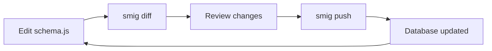

# Your first migration

This guide walks through the complete workflow of creating and managing database migrations with **smig**.

---

## Understanding the workflow



1. **Define** - Edit your schema file
2. **Diff** - Generate migration from changes
3. **Review** - Inspect the generated SQL
4. **Push** - Apply to the database

---

## Creating a schema

Let's build a blog application with users, posts, and comments.

### Step 1: Define the user table

```javascript
// schema.js
import {
  string,
  datetime,
  bool,
  array,
  record,
  index,
  defineSchema,
  composeSchema,
} from 'smig';

const userSchema = defineSchema({
  table: 'user',
  fields: {
    email: string()
      .required()
      .assert('string::is_email($value)'),
    name: string()
      .required()
      .length(2, 100),
    bio: string(),
    isActive: bool().default(true),
    createdAt: datetime().default('time::now()'),
    updatedAt: datetime().value('time::now()'),
  },
  indexes: {
    email: index(['email']).unique(),
    active: index(['isActive', 'createdAt']),
  },
});

export default composeSchema({
  models: { user: userSchema },
});
```

### Step 2: Generate the migration

```bash
smig diff --message "Add user table"
```

Output:

```sql
-- Forward migration
DEFINE TABLE user TYPE NORMAL SCHEMAFULL;
DEFINE FIELD email ON TABLE user TYPE string 
  ASSERT ($value != NONE) AND (string::is_email($value));
DEFINE FIELD name ON TABLE user TYPE string 
  ASSERT ($value != NONE) AND (string::len($value) >= 2) AND (string::len($value) <= 100);
DEFINE FIELD bio ON TABLE user TYPE string;
DEFINE FIELD isActive ON TABLE user TYPE bool DEFAULT true;
DEFINE FIELD createdAt ON TABLE user TYPE datetime DEFAULT time::now();
DEFINE FIELD updatedAt ON TABLE user TYPE datetime VALUE time::now();
DEFINE INDEX email ON TABLE user FIELDS email UNIQUE;
DEFINE INDEX active ON TABLE user FIELDS isActive, createdAt;
```

### Step 3: Apply the migration

```bash
smig push
```

---

## Adding more tables

### Step 4: Add posts and comments

```javascript
const postSchema = defineSchema({
  table: 'post',
  fields: {
    author: record('user').required(),
    title: string().required().length(1, 200),
    content: string().required(),
    published: bool().default(false),
    publishedAt: datetime(),
    createdAt: datetime().default('time::now()'),
  },
  indexes: {
    author: index(['author']),
    published: index(['published', 'publishedAt']),
  },
});

const commentSchema = defineSchema({
  table: 'comment',
  fields: {
    post: record('post').required(),
    author: record('user').required(),
    content: string().required(),
    createdAt: datetime().default('time::now()'),
  },
  indexes: {
    post: index(['post', 'createdAt']),
  },
});

export default composeSchema({
  models: {
    user: userSchema,
    post: postSchema,
    comment: commentSchema,
  },
});
```

### Step 5: Generate the new migration

```bash
smig diff --message "Add post and comment tables"
```

This generates only the changes (post and comment tables), not the user table again.

---

## Modifying existing tables

### Step 6: Add a field to users

```javascript
const userSchema = defineSchema({
  table: 'user',
  fields: {
    // ... existing fields ...
    avatar: string(),  // NEW FIELD
    role: string().default('user'),  // NEW FIELD
  },
  // ...
});
```

### Step 7: Generate the modification migration

```bash
smig diff --message "Add avatar and role to user"
```

Output:

```sql
-- Forward migration
DEFINE FIELD avatar ON TABLE user TYPE string;
DEFINE FIELD role ON TABLE user TYPE string DEFAULT 'user';

-- Rollback migration
REMOVE FIELD avatar ON TABLE user;
REMOVE FIELD role ON TABLE user;
```

---

## Rolling back changes

If you need to undo a migration:

```bash
smig rollback
```

This applies the down migration (rollback script) that was auto-generated.

---

## Checking status

View current migration state:

```bash
smig status
```

Output:

```
Migration Status
================

Database: test/test
Connected: ✓

Applied Migrations: 3
  1. 2024-01-15T10:30:00.000Z - Add user table
  2. 2024-01-15T10:45:00.000Z - Add post and comment tables
  3. 2024-01-15T11:00:00.000Z - Add avatar and role to user

Tables: user, post, comment
Schema: In sync ✓
```

---

## Next steps

- [Schema design](../guides/schema-design.md) - Learn effective patterns
- [CLI commands](../guides/cli-commands.md) - Master all commands
- [Tables reference](../schema-reference/tables.md) - All table options
- [Fields reference](../schema-reference/fields.md) - All field types

