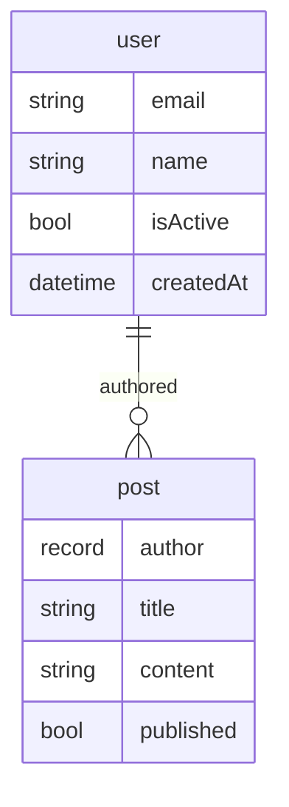

# CLI commands

Complete reference for **smig** command-line tools.

---

## Overview

```bash
smig <command> [options]
```

| Command | Description |
|---------|-------------|
| `init` | Initialize a new project |
| `diff` | Generate migration from schema changes |
| `push` | Apply pending migrations |
| `status` | Show migration status |
| `rollback` | Undo the last migration |
| `mermaid` | Generate ER diagram |

---

## `smig init`

Initialize a new **smig** project with starter files.

```bash
smig init [options]
```

### Options

| Option | Description | Default |
|--------|-------------|---------|
| `--schema <path>` | Path for schema file | `./schema.js` |
| `--config <path>` | Path for config file | `./smig.config.js` |
| `--force` | Overwrite existing files | `false` |

### Examples

```bash
# Default initialization
smig init

# Custom paths
smig init --schema ./db/schema.js --config ./db/config.js

# Overwrite existing files
smig init --force
```

### Generated files

**schema.js:**
```javascript
import { defineSchema, composeSchema, string, bool, datetime, index } from 'smig';

const userSchema = defineSchema({
  table: 'user',
  fields: {
    name: string(),
    email: string(),
    isActive: bool().default(true),
    createdAt: datetime().default('time::now()'),
  },
  indexes: {
    email: index(['email']).unique(),
  },
});

export default composeSchema({
  models: { user: userSchema },
});
```

**smig.config.js:**
```javascript
export default {
  url: 'ws://localhost:8000',
  namespace: 'test',
  database: 'test',
  username: 'root',
  password: 'root',
  schema: './schema.js',
};
```

---

## `smig diff`

Generate a migration by comparing your schema to the current database state.

```bash
smig diff [options]
```

### Options

| Option | Description | Default |
|--------|-------------|---------|
| `-m, --message <msg>` | Migration description | Timestamp |
| `-c, --config <path>` | Config file path | `./smig.config.js` |
| `--dry-run` | Show diff without saving | `false` |
| `--debug` | Enable debug output | `false` |

### Examples

```bash
# Generate with message
smig diff --message "Add user authentication"

# Preview without applying
smig diff --dry-run

# Custom config
smig diff --config ./production.config.js --message "Deploy v2"
```

### Output

```
Generating migration...

-- New table: user
DEFINE TABLE user TYPE NORMAL SCHEMAFULL;
DEFINE FIELD email ON TABLE user TYPE string ASSERT string::is_email($value);
DEFINE FIELD name ON TABLE user TYPE string ASSERT $value != NONE;
DEFINE INDEX email ON TABLE user FIELDS email UNIQUE;

Migration generated: 2024-01-15T10:30:00.000Z - Add user authentication
```

---

## `smig push`

Apply pending migrations to the database.

```bash
smig push [options]
```

### Options

| Option | Description | Default |
|--------|-------------|---------|
| `-c, --config <path>` | Config file path | `./smig.config.js` |
| `--force` | Skip confirmation prompts | `false` |
| `--debug` | Enable debug output | `false` |

### Examples

```bash
# Apply pending migrations
smig push

# Skip confirmation
smig push --force

# Custom config
smig push --config ./production.config.js
```

### Output

```
Applying migrations...

Migration 1/1: Add user authentication
  ✓ DEFINE TABLE user...
  ✓ DEFINE FIELD email...
  ✓ DEFINE INDEX email...

All migrations applied successfully!
```

---

## `smig status`

Show current migration status and database state.

```bash
smig status [options]
```

### Options

| Option | Description | Default |
|--------|-------------|---------|
| `-c, --config <path>` | Config file path | `./smig.config.js` |
| `--json` | Output as JSON | `false` |

### Examples

```bash
# Show status
smig status

# JSON output for scripting
smig status --json
```

### Output

```
Migration Status
================

Database: test/test
Connected: ✓

Applied Migrations: 3
  1. 2024-01-15T10:30:00.000Z - Initial schema
  2. 2024-01-16T14:00:00.000Z - Add posts table
  3. 2024-01-17T09:15:00.000Z - Add comments

Tables: user, post, comment
Relations: authored, commented

Schema Status: In sync ✓
```

---

## `smig rollback`

Undo the most recently applied migration.

```bash
smig rollback [options]
```

### Options

| Option | Description | Default |
|--------|-------------|---------|
| `-c, --config <path>` | Config file path | `./smig.config.js` |
| `--steps <n>` | Number of migrations to rollback | `1` |
| `--force` | Skip confirmation prompts | `false` |
| `--debug` | Enable debug output | `false` |

### Examples

```bash
# Rollback last migration
smig rollback

# Rollback multiple migrations
smig rollback --steps 3

# Skip confirmation
smig rollback --force
```

### Output

```
Rolling back migration: Add comments

  ✓ REMOVE TABLE comment...

Rollback complete. 2 migrations remaining.
```

---

## `smig mermaid`

Generate a Mermaid ER diagram from your schema.

```bash
smig mermaid [options]
```

### Options

| Option | Description | Default |
|--------|-------------|---------|
| `-c, --config <path>` | Config file path | `./smig.config.js` |
| `-o, --output <path>` | Output file path | stdout |

### Examples

```bash
# Output to terminal
smig mermaid

# Save to file
smig mermaid --output ./docs/schema.mmd

# Pipe to clipboard (macOS)
smig mermaid | pbcopy
```

### Output



---

## Global options

These options work with all commands:

| Option | Description |
|--------|-------------|
| `--help` | Show help for command |
| `--version` | Show smig version |
| `--debug` | Enable debug output |

---

## Environment variables

Configuration can also be set via environment variables:

| Variable | Description |
|----------|-------------|
| `SMIG_URL` | Database URL |
| `SMIG_NAMESPACE` | Database namespace |
| `SMIG_DATABASE` | Database name |
| `SMIG_USERNAME` | Authentication username |
| `SMIG_PASSWORD` | Authentication password |
| `SMIG_SCHEMA` | Path to schema file |
| `SMIG_CONFIG` | Path to config file |

Environment variables override config file values.

---

## See also

- [Multi-environment workflows](multi-environment.md)
- [Best practices](best-practices.md)

