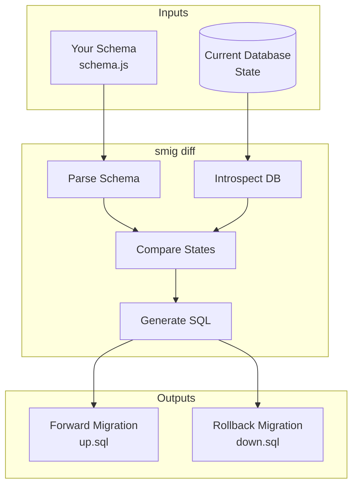

# Understanding migrations

How **smig** generates and manages database migrations.

---

## How migrations work



---

## The diffing algorithm

**smig** compares your schema definition against the current database state and generates the minimal set of changes:

### What it detects

| Change type | Forward (up) | Rollback (down) |
|-------------|--------------|-----------------|
| New table | `DEFINE TABLE` | `REMOVE TABLE` |
| Removed table | `REMOVE TABLE` | `DEFINE TABLE` |
| New field | `DEFINE FIELD` | `REMOVE FIELD` |
| Removed field | `REMOVE FIELD` | `DEFINE FIELD` |
| Modified field | `DEFINE FIELD OVERWRITE` | `DEFINE FIELD OVERWRITE` |
| New index | `DEFINE INDEX` | `REMOVE INDEX` |
| Removed index | `REMOVE INDEX` | `DEFINE INDEX` |
| New event | `DEFINE EVENT` | `REMOVE EVENT` |
| Modified event | `DEFINE EVENT OVERWRITE` | `DEFINE EVENT OVERWRITE` |

### Field modification detection

**smig** detects changes to:

- Field type (`string` → `int`)
- Default value
- Computed value expression
- Assertion conditions
- Permissions

---

## Migration history

Migrations are tracked in a `_migrations` table:

```sql
DEFINE TABLE _migrations SCHEMAFULL;
DEFINE FIELD appliedAt ON _migrations TYPE datetime;
DEFINE FIELD up ON _migrations TYPE string;
DEFINE FIELD down ON _migrations TYPE string;
DEFINE FIELD message ON _migrations TYPE option<string>;
DEFINE FIELD checksum ON _migrations TYPE string;
DEFINE FIELD downChecksum ON _migrations TYPE string;
```

### Checksum verification

Each migration includes SHA-256 checksums of both the up and down scripts. This ensures:

- Migrations haven't been modified after application
- Migration files match what was applied
- Corruption is detected early

---

## Migration lifecycle

### 1. Generation (`smig diff`)

```bash
smig diff --message "Add user roles"
```

- Parses your schema file
- Connects to database and introspects current state
- Computes differences
- Generates forward and rollback SQL
- Saves to `_migrations` table (not yet applied)

### 2. Application (`smig push`)

```bash
smig push
```

- Retrieves pending migrations
- Executes forward SQL in a transaction
- Updates `appliedAt` timestamp
- Verifies checksums

### 3. Rollback (`smig rollback`)

```bash
smig rollback
```

- Retrieves most recent migration
- Executes rollback SQL
- Removes migration record

---

## Handling failures

### Partial failures

If a migration fails partway through:

1. **smig** detects the partial state
2. Shows which statements succeeded/failed
3. Provides recovery options

### Recovery options

```bash
# Retry the failed migration
smig push --force

# Rollback to clean state
smig rollback --force

# Manual intervention
# Edit the database directly, then sync
smig diff --dry-run  # See current differences
```

---

## Safe migration practices

### Always review before pushing

```bash
# Generate and review
smig diff --message "Big change" --dry-run

# Then apply
smig push
```

### Use transactions

**smig** wraps migrations in transactions by default. If any statement fails, the entire migration is rolled back.

### Backup before major changes

```bash
# Export current state
surreal export --conn ws://localhost:8000 backup.surql

# Apply migration
smig push

# If needed, restore
surreal import --conn ws://localhost:8000 backup.surql
```

### Test in staging first

```bash
# Apply to staging
smig push --config ./staging.config.js

# Verify, then production
smig push --config ./production.config.js
```

---

## See also

- [CLI commands](cli-commands.md)
- [Multi-environment workflows](multi-environment.md)
- [Best practices](best-practices.md)

