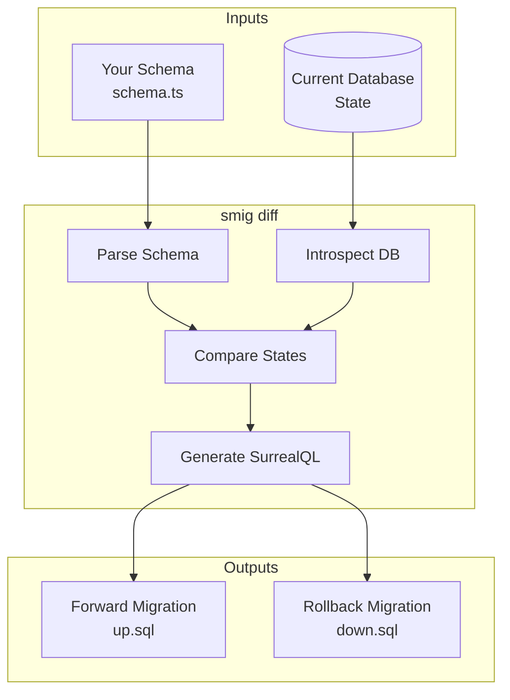

# Understanding migrations

How **smig** generates and manages database migrations.

## How migrations work

Unlike traditional migration tools that create numbered files, **smig** generates migrations on the fly by comparing your schema definition to the current database state. This means no migration files to manage—your schema is the single source of truth.

The migration lifecycle is a simple three-step process:



## The diffing algorithm

The core of **smig** is its diffing engine. It introspects your database, parses your schema file, and computes the exact changes needed to bring the database in line with your definition.

### What it detects

**smig** recognises a comprehensive set of schema changes. For each change type, it generates both a forward migration (to apply the change) and a rollback migration (to undo it):

| Change type | Forward (up) | Rollback (down) |
|-------------|--------------|-----------------|
| New table | `DEFINE TABLE` | `REMOVE TABLE` |
| Removed table | `REMOVE TABLE` | `DEFINE TABLE` |
| Renamed table | `ALTER TABLE RENAME` | `ALTER TABLE RENAME` |
| New field | `DEFINE FIELD` | `REMOVE FIELD` |
| Removed field | `REMOVE FIELD` | `DEFINE FIELD` |
| Renamed field | `ALTER FIELD RENAME` | `ALTER FIELD RENAME` |
| Modified field (1-3 props) | `ALTER FIELD ...` | `ALTER FIELD ...` |
| Modified field (4+ props) | `DEFINE FIELD OVERWRITE` | `DEFINE FIELD OVERWRITE` |
| New index | `DEFINE INDEX` | `REMOVE INDEX` |
| Removed index | `REMOVE INDEX` | `DEFINE INDEX` |
| New event | `DEFINE EVENT` | `REMOVE EVENT` |
| Modified event | `DEFINE EVENT OVERWRITE` | `DEFINE EVENT OVERWRITE` |

### Smart ALTER statements

Rather than always using `DEFINE OVERWRITE`, **smig** generates targeted `ALTER` statements for small changes. This produces cleaner, more readable migrations and reduces the risk of unintended side effects:

```surql
-- For single property changes, use ALTER
ALTER FIELD status ON TABLE user DEFAULT 'active';
ALTER FIELD email ON TABLE user ASSERT string::is_email($value);

-- For many changes at once, use OVERWRITE
DEFINE FIELD OVERWRITE profile ON TABLE user
  FLEXIBLE TYPE object
  DEFAULT {}
  READONLY;
```

### Field modification detection

When you modify a field in your schema, **smig** compares every property to detect exactly what changed. This allows it to generate the most efficient migration possible:

- Field type (`string` → `int`)
- Default value
- Computed value expression
- Assertion conditions
- Permissions

## Migration history

Every migration you apply is recorded in your database, creating an audit trail of schema changes. This history enables rollbacks and helps you understand how your schema evolved over time.

Migrations are tracked in a `_migrations` table:

```surql
DEFINE TABLE _migrations SCHEMAFULL;
DEFINE FIELD appliedAt ON _migrations TYPE datetime;
DEFINE FIELD up ON _migrations TYPE string;
DEFINE FIELD down ON _migrations TYPE string;
DEFINE FIELD message ON _migrations TYPE option<string>;
DEFINE FIELD checksum ON _migrations TYPE string;
DEFINE FIELD downChecksum ON _migrations TYPE string;
```

### Checksum verification

To protect against corruption or accidental modification, each migration record includes SHA-256 checksums. This ensures:

- Migrations haven’t been modified after application
- Migration files match what was applied
- Corruption is detected early

## Migration lifecycle

A typical workflow involves previewing changes, applying them, and occasionally rolling back. Each step has safeguards to prevent accidents.

### 1. Preview changes (`bun smig generate`)

Always preview before applying. This shows you exactly what SurrealQL will run, without touching the database:

```zsh
bun smig generate
```

- Parses your schema file
- Connects to database and introspects current state
- Computes differences
- Shows forward and rollback SQL

### 2. Apply changes (`bun smig migrate`)

Once you're happy with the preview, apply the migration. **smig** executes the SurrealQL and records the change in the migration history:

```zsh
# Preview changes without applying
bun smig migrate --dry-run

# Apply changes
bun smig migrate
```

What happens during `migrate`:

- Loads your schema file
- Compares to current database state
- Executes forward SQL
- Records the migration in `_migrations` table
- Stores checksums for integrity verification

### 3. Rollback (`bun smig rollback`)

Made a mistake? Rollback undoes the most recent migration by executing the stored down script:

```zsh
bun smig rollback
```

- Retrieves most recent migration
- Executes rollback SQL
- Removes migration record

## Handling failures

Migrations can fail for many reasons: invalid SurrealQL, constraint violations, or connection issues. **smig** provides tools to diagnose and recover from problems.

### Partial failures

If a migration fails partway through, your database may be in an inconsistent state:

1. **smig** detects the partial state
2. Shows which statements succeeded/failed
3. Provides recovery options

### Recovery options

Depending on the failure, you have several paths forward:

```zsh
# Retry the failed migration
bun smig migrate

# Rollback to clean state
bun smig rollback

# Manual intervention
# Edit the database directly, then sync
bun smig generate  # See current differences
```

## Safe migration practices

Following these practices reduces the risk of data loss and makes it easier to recover when things go wrong.

### Always review before applying

Never run `migrate` without first checking what will change. The `--dry-run` flag shows you the exact SQL without executing it:

```zsh
# Preview changes
bun smig migrate --dry-run

# Then apply
bun smig migrate
```

### Use transactions

**smig** wraps migrations in transactions by default. If any statement fails, the entire migration is rolled back automatically, leaving your database in its previous state.

### Backup before major changes

For production databases or complex migrations, create a backup first. SurrealDB's export command captures both schema and data:

```zsh
# Export current state
surreal export --conn ws://localhost:8000 backup.surql

# Apply migration
bun smig migrate

# If needed, restore
surreal import --conn ws://localhost:8000 backup.surql
```

### Test in staging first

Always test migrations in a staging environment before applying to production. This catches issues with real data that you might not see in development:

```zsh
# Apply to staging
bun smig migrate --config ./staging.config.ts

# Verify, then production
bun smig migrate --config ./production.config.ts
```

## See also

- [CLI commands](cli-commands.md)
- [Multi-environment workflows](multi-environment.md)
- [Best practices](best-practices.md)
