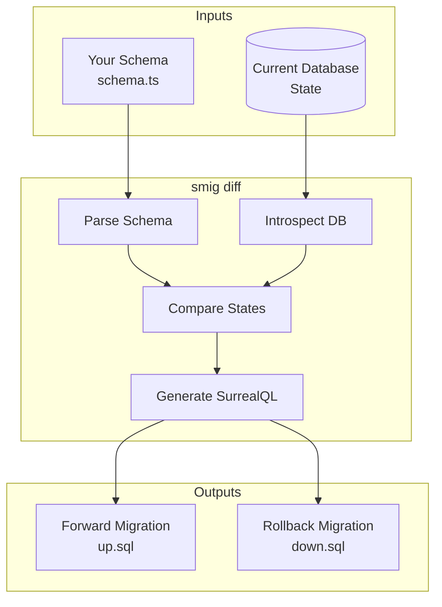

# Understanding migrations

How **smig** generates and manages database migrations.

## How migrations work

The migration lifecycle is a simple three-step process:



## The diffing algorithm

**smig** compares your schema definition against the current database state and generates the minimal set of changes:

### What it detects

| Change type | Forward (up) | Rollback (down) |
|-------------|--------------|-----------------|
| New table | `DEFINE TABLE` | `REMOVE TABLE` |
| Removed table | `REMOVE TABLE` | `DEFINE TABLE` |
| Renamed table | `ALTER TABLE RENAME` | `ALTER TABLE RENAME` |
| New field | `DEFINE FIELD` | `REMOVE FIELD` |
| Removed field | `REMOVE FIELD` | `DEFINE FIELD` |
| Renamed field | `ALTER FIELD RENAME` | `ALTER FIELD RENAME` |
| Modified field (1-3 props) | `ALTER FIELD ...` | `ALTER FIELD ...` |
| Modified field (4+ props) | `DEFINE FIELD OVERWRITE` | `DEFINE FIELD OVERWRITE` |
| New index | `DEFINE INDEX` | `REMOVE INDEX` |
| Removed index | `REMOVE INDEX` | `DEFINE INDEX` |
| New event | `DEFINE EVENT` | `REMOVE EVENT` |
| Modified event | `DEFINE EVENT OVERWRITE` | `DEFINE EVENT OVERWRITE` |

### Smart ALTER statements

**smig** uses granular `ALTER` statements when possible, which is more efficient than redefining entire fields:

```surql
-- For single property changes, use ALTER
ALTER FIELD status ON TABLE user DEFAULT 'active';
ALTER FIELD email ON TABLE user ASSERT string::is_email($value);

-- For many changes at once, use OVERWRITE
DEFINE FIELD OVERWRITE profile ON TABLE user
  FLEXIBLE TYPE object
  DEFAULT {}
  READONLY;
```

### Field modification detection

**smig** detects changes to:

- Field type (`string` → `int`)
- Default value
- Computed value expression
- Assertion conditions
- Permissions

## Migration history

Migrations are tracked in a `_migrations` table:

```surql
DEFINE TABLE _migrations SCHEMAFULL;
DEFINE FIELD appliedAt ON _migrations TYPE datetime;
DEFINE FIELD up ON _migrations TYPE string;
DEFINE FIELD down ON _migrations TYPE string;
DEFINE FIELD message ON _migrations TYPE option<string>;
DEFINE FIELD checksum ON _migrations TYPE string;
DEFINE FIELD downChecksum ON _migrations TYPE string;
```

### Checksum verification

Each migration includes SHA-256 checksums of both the up and down scripts. This ensures:

- Migrations haven't been modified after application
- Migration files match what was applied
- Corruption is detected early

## Migration lifecycle

### 1. Preview changes (`bun smig generate`)

Compare your schema definition with the database and preview the migration:

```bash
bun smig generate
```

- Parses your schema file
- Connects to database and introspects current state
- Computes differences
- Shows forward and rollback SQL

### 2. Apply changes (`bun smig migrate`)

Apply schema changes to your database:

```bash
# Preview changes without applying
bun smig migrate --dry-run

# Apply changes
bun smig migrate
```

What happens during `migrate`:

- Loads your schema file
- Compares to current database state
- Executes forward SQL
- Records the migration in `_migrations` table
- Stores checksums for integrity verification

### 3. Rollback (`bun smig rollback`)

Undo the most recent migration:

```bash
bun smig rollback
```

- Retrieves most recent migration
- Executes rollback SQL
- Removes migration record

## Handling failures

### Partial failures

If a migration fails partway through:

1. **smig** detects the partial state
2. Shows which statements succeeded/failed
3. Provides recovery options

### Recovery options

Commands to diagnose and recover from issues:

```bash
# Retry the failed migration
bun smig migrate

# Rollback to clean state
bun smig rollback

# Manual intervention
# Edit the database directly, then sync
bun smig generate  # See current differences
```

## Safe migration practices

### Always review before applying

Look at what will change before applying:

```bash
# Preview changes
bun smig migrate --dry-run

# Then apply
bun smig migrate
```

### Use transactions

**smig** wraps migrations in transactions by default. If any statement fails, the entire migration is rolled back.

### Backup before major changes

Protect your data before significant schema updates:

```bash
# Export current state
surreal export --conn ws://localhost:8000 backup.surql

# Apply migration
bun smig migrate

# If needed, restore
surreal import --conn ws://localhost:8000 backup.surql
```

### Test in staging first

Verify migrations work before production:

```bash
# Apply to staging
bun smig migrate --config ./staging.config.ts

# Verify, then production
bun smig migrate --config ./production.config.ts
```

## See also

- [CLI commands](cli-commands.md)
- [Multi-environment workflows](multi-environment.md)
- [Best practices](best-practices.md)

