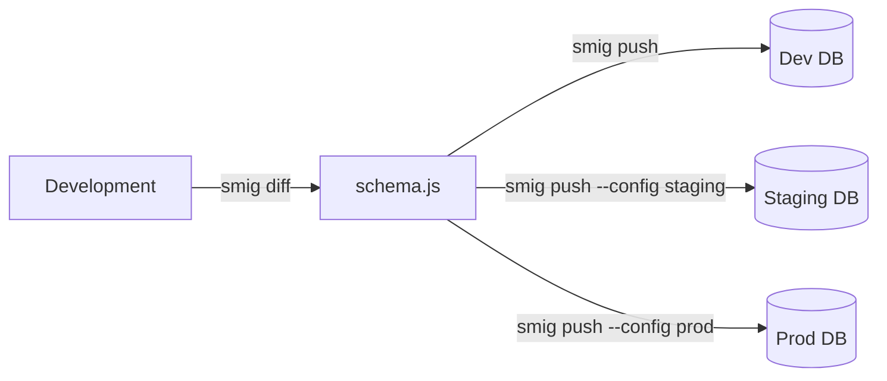

# Multi-environment workflows

Configure **smig** for development, staging, and production environments.

---

## Configuration files

Create separate config files for each environment:

```
project/
├── smig.config.js          # Development (default)
├── smig.staging.config.js  # Staging
├── smig.production.config.js # Production
└── schema.js               # Shared schema
```

### Development config

```javascript
// smig.config.js
export default {
  url: 'ws://localhost:8000',
  namespace: 'dev',
  database: 'myapp',
  username: 'root',
  password: 'root',
  schema: './schema.js',
};
```

### Staging config

```javascript
// smig.staging.config.js
export default {
  url: 'wss://staging.surrealdb.example.com',
  namespace: 'staging',
  database: 'myapp',
  username: process.env.SURREAL_USER,
  password: process.env.SURREAL_PASS,
  schema: './schema.js',
};
```

### Production config

```javascript
// smig.production.config.js
export default {
  url: 'wss://prod.surrealdb.example.com',
  namespace: 'production',
  database: 'myapp',
  username: process.env.SURREAL_USER,
  password: process.env.SURREAL_PASS,
  schema: './schema.js',
};
```

---

## Using environment-specific configs

```bash
# Development (default)
smig diff --message "Add feature"
smig push

# Staging
smig push --config smig.staging.config.js

# Production
smig push --config smig.production.config.js
```

---

## Environment variables

For CI/CD pipelines, use environment variables:

```bash
# Set via environment
export SMIG_URL="wss://prod.surrealdb.example.com"
export SMIG_NAMESPACE="production"
export SMIG_DATABASE="myapp"
export SMIG_USERNAME="deploy"
export SMIG_PASSWORD="$DEPLOY_PASSWORD"

# Run without config file
smig push
```

### Variable precedence

1. Command-line arguments (highest)
2. Environment variables
3. Config file
4. Defaults (lowest)

---

## Package.json scripts

```json
{
  "scripts": {
    "db:diff": "smig diff",
    "db:push": "smig push",
    "db:push:staging": "smig push --config smig.staging.config.js",
    "db:push:prod": "smig push --config smig.production.config.js",
    "db:status": "smig status",
    "db:status:staging": "smig status --config smig.staging.config.js",
    "db:status:prod": "smig status --config smig.production.config.js"
  }
}
```

---

## CI/CD integration

### GitHub Actions

```yaml
# .github/workflows/deploy.yml
name: Deploy Database

on:
  push:
    branches: [main]

jobs:
  migrate:
    runs-on: ubuntu-latest
    steps:
      - uses: actions/checkout@v4
      
      - uses: oven-sh/setup-bun@v1
      
      - run: bun install
      
      - name: Apply migrations
        env:
          SMIG_URL: ${{ secrets.SURREAL_URL }}
          SMIG_NAMESPACE: production
          SMIG_DATABASE: myapp
          SMIG_USERNAME: ${{ secrets.SURREAL_USER }}
          SMIG_PASSWORD: ${{ secrets.SURREAL_PASS }}
        run: |
          bun smig status
          bun smig push --force
```

### GitLab CI

```yaml
# .gitlab-ci.yml
migrate:
  stage: deploy
  script:
    - bun install
    - bun smig push --force
  variables:
    SMIG_URL: $SURREAL_URL
    SMIG_NAMESPACE: production
    SMIG_DATABASE: myapp
    SMIG_USERNAME: $SURREAL_USER
    SMIG_PASSWORD: $SURREAL_PASS
  only:
    - main
```

---

## Workflow patterns

### Development → Staging → Production



1. Develop and test schema changes locally
2. Push to staging for QA
3. After approval, push to production

### Feature branch workflow

```bash
# On feature branch
smig diff --message "Feature: user profiles"
smig push  # To dev database

# After merge to main
smig push --config smig.staging.config.js
smig push --config smig.production.config.js
```

---

## See also

- [CLI commands](cli-commands.md)
- [Best practices](best-practices.md)

