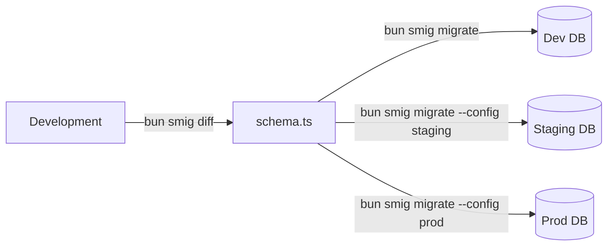

# Multi-environment workflows

Configure **smig** for development, staging, and production environments.

## Configuration files

Most projects need at least two environments: development (your local machine) and production. Larger teams often add staging for QA testing. Here's how to structure your configuration:

Create separate config files for each environment:

```
project/
├── smig.config.ts          # Development (default)
├── smig.staging.config.ts  # Staging
├── smig.production.config.ts # Production
└── schema.ts               # Shared schema
```

### Development config

Your local environment should use predictable values and an in-memory or local SurrealDB instance:

```typescript
// smig.config.ts
export default {
  url: 'ws://localhost:8000',
  namespace: 'dev',
  database: 'citadel',
  username: 'root',
  password: 'root',
  schema: './schema.ts',
};
```

### Staging config

Staging should mirror production as closely as possible—same database version, similar data volume, and identical schema:

```typescript
// smig.staging.config.ts
export default {
  url: 'wss://staging.surrealdb.example.com',
  namespace: 'staging',
  database: 'citadel',
  username: process.env.SURREAL_USER,
  password: process.env.SURREAL_PASS,
  schema: './schema.ts',
};
```

### Production config

Never hardcode production credentials. Always use environment variables for sensitive values:

```typescript
// smig.production.config.ts
export default {
  url: 'wss://prod.surrealdb.example.com',
  namespace: 'production',
  database: 'citadel',
  username: process.env.SURREAL_USER,
  password: process.env.SURREAL_PASS,
  schema: './schema.ts',
};
```

## Using environment-specific configs

The `--config` flag tells **smig** which configuration to use. Without it, **smig** looks for `smig.config.ts` in your project root:

```zsh
# Development (default)
bun smig diff
bun smig migrate

# Staging
bun smig migrate --config smig.staging.config.ts

# Production
bun smig migrate --config smig.production.config.ts
```

## Environment variables

In automated pipelines, you often can't use config files because credentials come from secrets management. Environment variables solve this:

```zsh
# Set via environment
export SMIG_URL="wss://prod.surrealdb.example.com"
export SMIG_NAMESPACE="production"
export SMIG_DATABASE="citadel"
export SMIG_USERNAME="deploy"
export SMIG_PASSWORD="$DEPLOY_PASSWORD"

# Run without config file
bun smig migrate
```

### Variable precedence

When the same setting is defined in multiple places, **smig** uses this priority order:

1. Command-line arguments (highest)
2. Environment variables
3. Config file
4. Defaults (lowest)

## Package.json scripts

Define npm/bun scripts to avoid typing long config paths repeatedly. This also documents which environments your team uses:

```typescript
{
  "scripts": {
    "db:diff": "bun smig diff",
    "db:push": "bun smig migrate",
    "db:push:staging": "bun smig migrate --config smig.staging.config.ts",
    "db:push:prod": "bun smig migrate --config smig.production.config.ts",
    "db:status": "bun smig status",
    "db:status:staging": "bun smig status --config smig.staging.config.ts",
    "db:status:prod": "bun smig status --config smig.production.config.ts"
  }
}
```

## CI/CD integration

Automating migrations in your deployment pipeline ensures schema changes are applied consistently. Here are examples for popular CI platforms.

### GitHub Actions

This workflow applies migrations automatically when code is merged to main:

```yaml
# .github/workflows/deploy.yml
name: Deploy Database

on:
  push:
    branches: [main]

jobs:
  migrate:
    runs-on: ubuntu-latest
    steps:
      - uses: actions/checkout@v4
      
      - uses: oven-sh/setup-bun@v1
      
      - run: bun install
      
      - name: Apply migrations
        env:
          SMIG_URL: ${{ secrets.SURREAL_URL }}
          SMIG_NAMESPACE: production
          SMIG_DATABASE: citadel
          SMIG_USERNAME: ${{ secrets.SURREAL_USER }}
          SMIG_PASSWORD: ${{ secrets.SURREAL_PASS }}
        run: |
          bun smig status
          bun smig migrate --force
```

### GitLab CI

The same workflow for GitLab's CI system:

```yaml
# .gitlab-ci.yml
migrate:
  stage: deploy
  script:
    - bun install
    - bun smig migrate --force
  variables:
    SMIG_URL: $SURREAL_URL
    SMIG_NAMESPACE: production
    SMIG_DATABASE: citadel
    SMIG_USERNAME: $SURREAL_USER
    SMIG_PASSWORD: $SURREAL_PASS
  only:
    - main
```

## Workflow patterns

These patterns help teams coordinate schema changes safely. Choose the one that matches your deployment style.

### Development → Staging → Production

The classic promotion pipeline. Changes flow through each environment before reaching production:



1. Develop and test schema changes locally
2. Push to staging for QA
3. After approval, push to production

### Feature branch workflow

For teams using feature branches, test schema changes locally before merging:

```zsh
# On feature branch
bun smig diff
bun smig migrate  # To dev database

# After merge to main
bun smig migrate --config smig.staging.config.ts
bun smig migrate --config smig.production.config.ts
```

## See also

- [CLI commands](cli-commands.md)
- [Best practices](best-practices.md)
