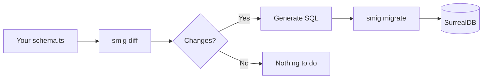

<div class="two-column-layout">
<div class="main-column">

## What is smig?

**smig** is a schema migration tool for [SurrealDB](https://surrealdb.com). You define your database structure in TypeScript, and **smig** figures out what SurrealQL (SQL) to run to make your database match.

Think of it like this: instead of writing SurrealQL migrations by hand, you describe what your database should look like, and **smig** works out the steps to get there.

```typescript
import { defineSchema, string, datetime, index } from 'smig';

const users = defineSchema({
  table: 'user',
  fields: {
    email: string().required(),
    name: string(),
    createdAt: datetime().default('time::now()'),
  },
  indexes: {
    email: index(['email']).unique(),
  },
});
```

Run `bun smig migrate` and this becomes:

```surql
DEFINE TABLE user TYPE NORMAL SCHEMAFULL;
DEFINE FIELD email ON TABLE user TYPE string ASSERT $value != NONE;
DEFINE FIELD name ON TABLE user TYPE string;
DEFINE FIELD createdAt ON TABLE user TYPE datetime DEFAULT time::now();
DEFINE INDEX email ON TABLE user FIELDS email UNIQUE;
```

## Why smig?

### If you’re evaluating tools

**smig** is the only migration tool built specifically for SurrealDB 3. It understands SurrealDB’s unique features:

- **Graph relations** — First-class support for SurrealDB’s relation tables
- **Vector indexes** — HNSW and MTREE for AI/ML similarity search
- **Full-text search** — Custom analyzers with tokenizers and filters
- **Multi-model** — Tables, documents, and graphs in one schema

### If you’re a developer

The API is designed to feel natural:

```typescript
// Fields have chainable methods
email: string()
  .required()
  .assert('string::is_email($value)')
  .comment('Primary contact email')

// Indexes are just as readable
emailIndex: index(['email'])
  .unique()
  .comment('Unique constraint on email')

// Vector search is one line
embeddingIndex: index(['embedding'])
  .hnsw(1536)
  .dist('COSINE')
```

## How it works

At its core, **smig** follows a simple, robust workflow:



1. **You write** a schema file describing your tables, fields, indexes
2. **smig compares** your schema to what’s in the database
3. **smig generates** the SQL needed to sync them up
4. **You run** `bun smig migrate` to apply the changes
5. **smig records** the migration so it knows what’s been applied

## What can you define?

**smig** covers nearly everything in SurrealDB 3:

| What | Why you’d use it |
|------|------------------|
| [Tables](/schema-reference/tables) | Store your data |
| [Fields](/schema-reference/fields) | Define columns with types and validation |
| [Indexes](/schema-reference/indexes) | Speed up queries, enforce uniqueness, vector search |
| [Events](/schema-reference/events) | Run logic when data changes |
| [Relations](/schema-reference/relations) | Connect records in a graph |
| [Functions](/schema-reference/functions) | Reusable database logic |
| [Analyzers](/schema-reference/analyzers) | Configure full-text search |
| [Access](/schema-reference/access) | Authentication methods |
| [Params](/schema-reference/params) | Global configuration values |
| [Sequences](/schema-reference/sequences) | Auto-incrementing numbers |

</div>
<div class="sidebar-column">

<div class="sidebar-card">

### Quick start

Get up and running in seconds:

```bash
# Install
bun add -D smig

# Initialize
bun smig init

# Start SurrealDB
surreal start memory

# Apply schema
bun smig migrate
```

[Full installation guide ›](/getting-started/installation)

</div>

<div class="sidebar-card">

### CLI commands

| Command | Description |
|---------|-------------|
| `bun smig init` | Create starter files |
| `bun smig diff` | Preview changes |
| `bun smig migrate` | Apply changes |
| `bun smig rollback` | Undo last migration |
| `bun smig status` | Show status |

[CLI reference ›](/guides/cli-commands)

</div>

<div class="sidebar-card">

### Documentation

**Getting started**
<br>
New to **smig**? [Start here ›](/getting-started/)

**Guides**
<br>
[Schema design](/guides/schema-design), [migrations](/guides/migrations), [multi-environment](/guides/multi-environment)

**Schema reference**
<br>
Every option, with examples. [Browse ›](/schema-reference/)

**Examples**
<br>
[Blog](/examples/blog), [Social network](/examples/social-network), [E-commerce](/examples/ecommerce), [AI embeddings](/examples/ai-embeddings)

</div>

<div class="sidebar-card">

### Get involved

- [GitHub](https://github.com/kathysledge/smig)
- [Report issues](https://github.com/kathysledge/smig/issues)
- [Discussions](https://github.com/kathysledge/smig/discussions)

If **smig** saves you time, consider [supporting development](https://ko-fi.com/kathysledge) ☕

</div>

</div>
</div>

<style>
.two-column-layout {
  display: grid;
  grid-template-columns: 1fr 320px;
  gap: 2rem;
  margin-top: 2rem;
}

.main-column {
  min-width: 0;
}

.sidebar-column {
  display: flex;
  flex-direction: column;
  gap: 1rem;
}

.sidebar-card {
  background: var(--vp-c-bg-soft);
  border-radius: 8px;
  padding: 1.25rem;
}

.sidebar-card h3 {
  margin-top: 0;
  margin-bottom: 0.75rem;
  font-size: 1rem;
  border-bottom: none;
}

.sidebar-card p {
  margin: 0.5rem 0;
  font-size: 0.9rem;
}

.sidebar-card pre {
  font-size: 0.8rem;
}

.sidebar-card table {
  font-size: 0.85rem;
  margin: 0.5rem 0;
}

.sidebar-card table td,
.sidebar-card table th {
  padding: 0.25rem 0.5rem;
}

.sidebar-card a {
  font-size: 0.9rem;
}

@media (max-width: 960px) {
  .two-column-layout {
    grid-template-columns: 1fr;
  }
  
  .sidebar-column {
    order: -1;
  }
}
</style>
