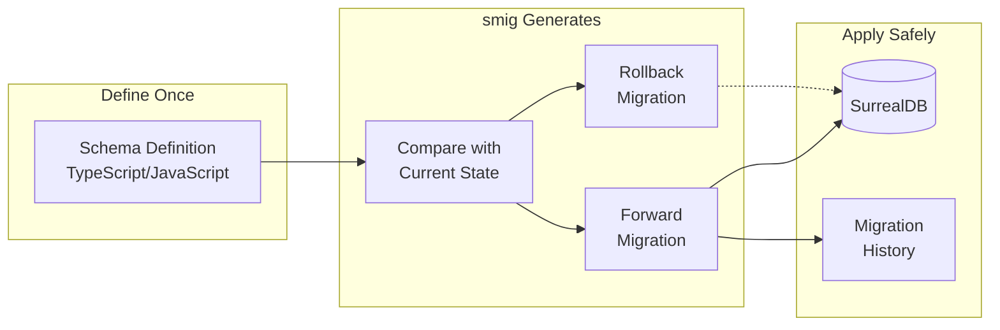
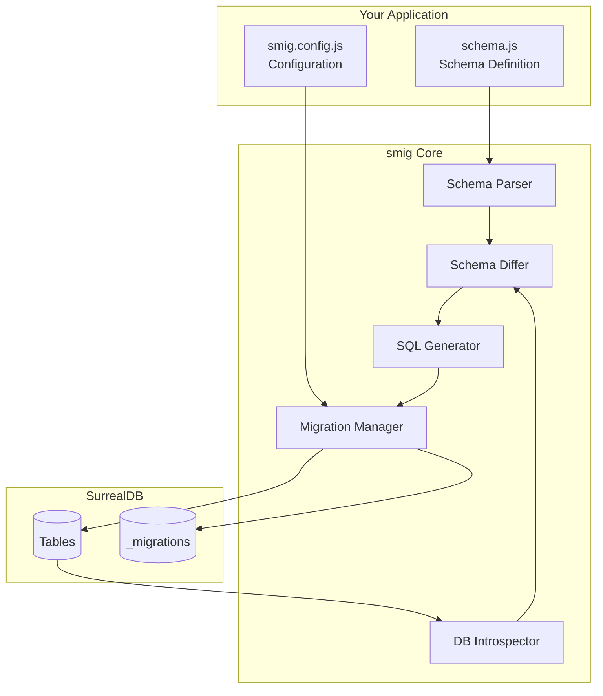

## Automatic schema migrations for SurrealDB

**smig** is the first library to provide automatic migration generation for SurrealDB. Define your schema once using a type-safe API, and let **smig** handle the rest.

## The problem

Database schema management is one of the most error-prone aspects of application development:

- **Manual migration scripts** are tedious to write and easy to get wrong
- **Schema drift** between environments causes production incidents
- **Rollbacks** require manually reversing every change
- **No single source of truth** for your database structure

## The solution

**smig** brings production-grade schema management to SurrealDB with a declarative, code-first approach:



---

## Key capabilities

### For technical decision-makers

| Capability | Business value |
|------------|----------------|
| **Automatic migration generation** | Reduce developer time spent on schema changes by 80% |
| **Bidirectional migrations** | Instant rollbacks reduce incident recovery time |
| **Type-safe schema definition** | Catch errors at development time, not production |
| **Migration checksums** | Detect unauthorized or corrupted schema changes |
| **Multi-environment support** | Consistent schemas across dev, staging, and production |
| **Full SurrealDB v3 support** | Vector search, full-text, graph relations, and more |

### For developers

| Feature | Description |
|---------|-------------|
| **Fluent builder API** | Intuitive, chainable methods with full TypeScript intellisense |
| **All field types** | String, int, float, datetime, uuid, array, record, geometry, and more |
| **Advanced indexes** | Unique, HNSW vector search, full-text with BM25, count indexes |
| **Graph relations** | First-class support for SurrealDB's relation tables |
| **Events & triggers** | Define business logic that runs on CREATE, UPDATE, DELETE |
| **Custom functions** | Reusable database functions with parameters and return types |
| **Authentication** | Define access methods with SIGNUP/SIGNIN logic |
| **Full-text search** | Custom analyzers with tokenizers and filters |
| **CLI tools** | Generate, apply, rollback, and inspect migrations |

---

## Architecture



---

## How it works

### 1. Define your schema

```javascript
import { defineSchema, composeSchema, string, datetime, record, index } from 'smig';

const userSchema = defineSchema({
  table: 'user',
  fields: {
    email: string().assert('string::is_email($value)'),
    name: string().required(),
    createdAt: datetime().default('time::now()'),
  },
  indexes: {
    email: index(['email']).unique(),
  },
});

export default composeSchema({
  models: { user: userSchema },
});
```

### 2. Generate migrations

```bash
smig diff --message "Add user table"
```

**smig** compares your schema to the database and generates:

```sql
-- Forward migration
DEFINE TABLE user TYPE NORMAL SCHEMAFULL;
DEFINE FIELD email ON TABLE user TYPE string ASSERT string::is_email($value);
DEFINE FIELD name ON TABLE user TYPE string ASSERT $value != NONE;
DEFINE FIELD createdAt ON TABLE user TYPE datetime DEFAULT time::now();
DEFINE INDEX email ON TABLE user FIELDS email UNIQUE;

-- Rollback migration (auto-generated)
REMOVE TABLE user;
```

### 3. Apply to your database

```bash
smig push
```

---

## Comparison with alternatives

| Feature | smig | Raw SurrealQL | Other tools |
|---------|------|---------------|-------------|
| Automatic migration generation | ✅ | ❌ | ❌ |
| Bidirectional migrations | ✅ | ❌ | Partial |
| Type-safe schema definition | ✅ | ❌ | Partial |
| SurrealDB v3 support | ✅ | ✅ | ❌ |
| Vector index support (HNSW) | ✅ | ✅ | ❌ |
| Full-text search config | ✅ | ✅ | ❌ |
| Graph relation support | ✅ | ✅ | ❌ |
| Migration history tracking | ✅ | ❌ | ✅ |
| Checksum verification | ✅ | ❌ | Partial |

---

## Quick start

### Installation

```bash
# Using bun (recommended)
bun add -D smig

# Using npm
npm install -D smig

# Using pnpm
pnpm add -D smig
```

### Initialize

```bash
smig init
```

### Generate and apply

```bash
smig diff --message "Initial schema"
smig push
```

[Get started →](getting-started/index.md)

---

## Documentation

### Getting started
- [Quick start guide](getting-started/index.md)
- [Installation](getting-started/installation.md)
- [Your first migration](getting-started/first-migration.md)

### Guides
- [Schema design patterns](guides/schema-design.md)
- [Understanding migrations](guides/migrations.md)
- [CLI commands](guides/cli-commands.md)
- [Multi-environment workflows](guides/multi-environment.md)
- [Best practices](guides/best-practices.md)

### Schema reference
- [Tables](schema-reference/tables.md)
- [Fields](schema-reference/fields.md)
- [Indexes](schema-reference/indexes.md)
- [Events](schema-reference/events.md)
- [Relations](schema-reference/relations.md)
- [Functions](schema-reference/functions.md)
- [Analyzers](schema-reference/analyzers.md)
- [Access (auth)](schema-reference/access.md)
- [Params](schema-reference/params.md)
- [Sequences](schema-reference/sequences.md)

### Examples
- [Simple blog](examples/blog.md)
- [Social network](examples/social-network.md)
- [E-commerce](examples/ecommerce.md)
- [AI embeddings with vector search](examples/ai-embeddings.md)

---

## Support the project

If **smig** saves you time, consider supporting development:

[](https://buymeacoffee.com/kathysledge)

---

## License

ISC License - see [LICENSE](../LICENSE) for details.
